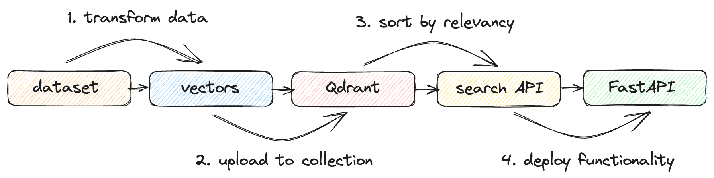

This tutorial shows you how to build and deploy your own neural search service to look through descriptions of companies from startups-list.com and pick the most similar ones to your query. The website contains the company names, descriptions, locations, and a picture for each entry.

A neural search service uses artificial neural networks to improve the accuracy and relevance of search results. Besides offering simple keyword results, this system can retrieve results by meaning. It can understand and interpret complex search queries and provide more contextually relevant output, effectively enhancing the user’s search experience.

## Workflow
To create a neural search service, you will need to transform your raw data and then create a search function to manipulate it. First, you will 
1) Prepare a sample dataset using a modified version of the BERT ML model. 
2) Load the data into Qdrant
3) Create a neural search API
4) Serve it using FastAPI.

